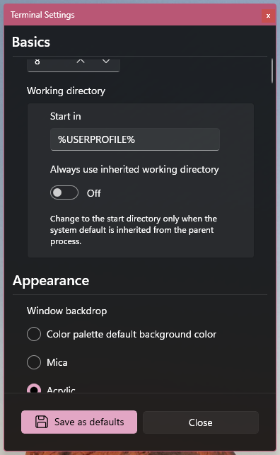

# Furminal
**Furminal** is a terminal emulator for Windows, based on **Terminal**'s WinUI 3 **TerminalControl**. It uses the Windows pseudoconsole API behind the scenes. It is fully featured, supporting a combination of 1970s-era bleeding-edge features and today's popular features.

**Furminal** is a WinUI 3 application for .NET 8.0 and is available as pre-built x64 and ARM64 packaged app releases, signed with a self-signed certificate. It runs on Windows 11 and should support Windows 10 as well, though I haven't tested it. **Terminal** provides **TerminalControl**, a C# WinUI 3 user control based on the Win2D CanvasControl.

.](screenshots/Furminal.png)


## Features
**Terminal** implements most commonly used terminal emulator features. It aims to be roughly compatible with Windows Terminal and implements a lot of xterm-like behavior. Modern terminal emulators are much more than VT100 emulators—it is difficult to definitively declare which standards are "fully" implemented, due to a lack of standardization and a lack of mass adoption of niche features across the board.

That being said, here's a smattering of features worth pointing out:
- 24-bit color via type-2 SGR escape sequences (and also 8-bit color via type-5 sequences)
- Undercurl support (SGR underline extension)
- Full Unicode 16.0.0 support, including full-color emoji
- Theme change reporting (DECSET/DECRST 2031)
- Window resize reporting (DECSET/DECRST 2048)
- Nice font antialiasing
- A paw print logo
- Color palette customization
- GPU-accelerated drawing via Win2D
- Pretty Good vttest pass rate (see [vttest-results.md](docs/vttest-results.md))
- Pretty Good performance

Additionally, **Furminal** implements the following features:
- Several choices of window backdrop types to choose from, from solid colors to complete transparency
- A minimalist appearance
- Some basic command-line options

## Limitations
Terminal emulators are complex. An exhaustive list of limitations would be pretty difficult to produce, but here are some highlights. The vast majority of these were conscious design decisions.
- Many 1970s-era features that are not relevant today (Tektronix mode, 132-column mode, etc.)
- A lot of xterm extensions that don't apply to modern Windows systems but are very useful for niche/older systems (Sun-specific keyboard mappings, window manager hints, etc.)
- readline-related DECSET/DECRST sequences
- SGR blink
- SGR conceal
- rxvt-specific DECSET/DECRST sequences
- Win32 input mode, as used by Windows Terminal
- The kitty keyboard protocol
- Tabs, panes, profiles, etc.

## Future Considerations
- Hyperlink handling and [OSC 8 hyperlinks](https://github.com/Alhadis/OSC8-Adoption)

## Similar Projects
For Windows/ConPTY specifically:
- [Alacritty](https://github.com/alacritty/alacritty/)
- [WezTerm](https://wezterm.org/)
- [Windows Terminal](https://github.com/microsoft/terminal/)

The other major players, but not for Windows/ConPTY:
- [Ghostty](https://github.com/ghostty-org/ghostty/)
- [GNOME Terminal](https://gitlab.gnome.org/GNOME/gnome-terminal), and other [VTE](https://gitlab.gnome.org/GNOME/vte)-based terminals
- [hterm](https://chromium.googlesource.com/apps/libapps/+/HEAD/hterm/)
- [iTerm2](https://iterm2.com/)
- [kitty](https://sw.kovidgoyal.net/kitty/)
- [Konsole](https://konsole.kde.org/)
- [Mintty](https://mintty.github.io/)
- [Terminal (for Mac)](https://en.wikipedia.org/wiki/Terminal_(macOS))
- The one that started it all, [xterm](https://invisible-island.net/xterm/)
- [xterm.js](https://xtermjs.org/)

## License
**Furminal** and **Terminal** are released under the MIT license. They utilize third-party licensed components; see [THIRD-PARTY-NOTICES.md](THIRD-PARTY-NOTICES.md) for details.

## Why?
Why create another terminal emulator when there are already so many? Well, I needed a WinUI 3 terminal control to work with [TermBar](https://github.com/spakov/termbar). At first, I thought Windows Terminal would work perfectly and I could just pop an instance of it in there. But then I started reading about Windows Terminal and the fact that the terminal emulator bits are actually written in C++ and are thoroughly native, and more importantly, the reasons those decisions were made. Could I have worked in a Windows Terminal instead of writing my own? Yes. Would it have been as much fun? Absolutely not.

Microsoft has a great explanation about this in the [Windows Terminal GitHub repository](https://github.com/microsoft/terminal?tab=readme-ov-file#creating-the-new-windows-terminal). (Side note: I really like Microsoft's use of `CA5CAD1A` in their Windows Terminal project GUIDs.) I also highly recommended the five-part [Windows Command-Line blog post series](https://devblogs.microsoft.com/commandline/windows-command-line-backgrounder/) by Rich Turner for an explanation of the *immense* complexity of all the layers that come together and had to be updated to make terminal emulators possible on Windows.

I'm not sure there are any other terminal emulators written in C#/.NET, and I was frankly concerned that I'd encounter insurmountable roadblocks, either through requiring too many native APIs or performance penalties. However, that's really not the case—obviously, **Terminal**/**Furminal** can't match C++-based terminal emulators in terms of raw speed, but it is *thoroughly* competitive.

If you've been toying with the idea of writing a terminal emulator, I say go for it. You'll learn about escape sequences. You'll learn why all those control characters exist. You'll learn about character encodings. You'll learn more about Unicode than you ever wanted to know. You'll learn why there are so many different keyboard input schemes and why none of them are perfect. You'll memorize DECSET/DECRST private mode numbers. You'll learn why scrollback is always configured in lines, not bytes. You'll learn that Thomas Dickey is perhaps one of the most influential individuals in the way power users interact with computers today.

Anyway, long story short: drop-in WinUI 3 terminal emulator control.

## Configuration
I'm going to break this into two subsections: one for **Furminal** and one for **Terminal**.

### Furminal
**Furminal** uses a JSON configuration file. It does not write the configuration file by default, though this can be accomplished in the settings window. If the context menu is enabled (which it is, by default), right click the terminal to open its settings and see the location of this file. **Furminal** never writes to the configuration file unless you click "Save as defaults." It does, however, automatically load settings from the configuration file when it is saved, as long as the settings window is open.

The vast majority of the **Furminal** settings are simply bound directly to **TerminalControl**'s dependency properties.



In the [schema](schema/) directory, the **Furminal** configuration schema is available, including descriptions, defaults, and allowed ranges. A markdown file containing a human-readable description of the schema is also available.

### Terminal
Being a WinUI 3 control, **Terminal** leverages the [DependencyProperty](https://learn.microsoft.com/en-us/uwp/api/windows.ui.xaml.dependencyproperty?view=winrt-26100) for configuration. Long story short, if you're not a XAML expert, these are what you're interacting with behind the scenes when you have something like this:

```xml
<Button Background="Blue" Foreground="Red" Content="This is a button"/>
```

Or, for **Terminal**:

```xml
<terminal:TerminalControl
  x:Name="TerminalControl"
  DefaultWindowTitle="Furminal"
  AnsiColors="{x:Bind ViewModel.AnsiColors}"
  ConsoleOutput="{x:Bind ViewModel.ConsoleOutput}"
  ConsoleInput="{x:Bind ViewModel.ConsoleInput}"
  Rows="{x:Bind ViewModel.Rows, Mode=TwoWay}"
  Columns="{x:Bind ViewModel.Columns, Mode=TwoWay}"
  ShowSettingsSaveAsDefaultsButton="True"
  TerminalResize="TerminalControl_TerminalResize"
  Loaded="TerminalControl_Loaded"
  Grid.Row="1"
  Grid.Column="0"/>
```

Here's a description of **Terminal** properties handled by dependency properties:

#### ConsoleOutput
The output [FileStream](https://learn.microsoft.com/en-us/dotnet/api/system.io.filestream?view=net-8.0) from the underlying ConPTY-provided console host process.

There is no default and this is required to facilitate terminal communication.

#### ConsoleInput
The input [FileStream](https://learn.microsoft.com/en-us/dotnet/api/system.io.filestream?view=net-8.0) from the underlying ConPTY-provided console host process.

There is no default and this is required to facilitate terminal communication.

#### AnsiColors
A palette of ANSI colors, used to support the 16 basic colors supported by any terminal emulator.

The default is the [Catppuccin](https://github.com/modkavartini/catppuccin) palette colors.

#### TerminalCapabilities
A low-level configuration for supported ANSI features, like which SGR sequences are supported, whether the Home and End keys behave exactly like they do in xterm, and so on.

The default settings work out of the box and I recommend avoiding changing them unless there's a specific issue you're trying to work around.

#### DefaultWindowTitle
The default window title associated with the terminal.

The default is `TerminalControl`.

#### Rows
The number of rows in the terminal.

The default is 24.

#### Columns
The number of columns in the terminal.

The default is 80.

#### Scrollback
The number of scrollback rows to maintain.

The default is 5000.

#### LinesPerScrollback
The number of lines at a time to scroll back and scroll forward (Shift-Page Up and Shift-Page Down).

The default is 12.

#### LinesPerSmallScrollback
The number of lines at a time to scroll back and scroll forward when using a small scrollback (Shift-Up and Shift-Down).

The default is 1.

#### LinesPerWheelScrollback
The number of lines at a time to scroll back and scroll forward when using the mouse wheel.

The default is 8.

#### FontFamily
The font family with which to render text.

The default is 0xProto Nerd Font Propo.

#### FontSize
The font size in which to render text.

The default is 14.

#### TextAntialiasing
The text antialising style with which to render text.

The default is Grayscale.

#### FullColorEmoji
Whether to render full-color emoji using the Microsoft Segoe UI Emoji font.

The default is false.

#### UseBackgroundColorErase
Whether to use background color erase, which applies the current graphic rendition's background color when erasing terminal cells. (See [https://sunaku.github.io/vim-256color-bce.html](https://sunaku.github.io/vim-256color-bce.html) for a visual depiction of this.)

The default is true.

#### BackgroundIsInvisible
Whether to render the default background color (which comes from AnsiColors) as transparent. Does not apply when the alternate screen buffer is active.

The default is true.

#### UseVisualBell
Whether to generate an event when the terminal bell rings rather than playing a sound.

The default is true.

#### CursorStyle
The terminal's cursor style: block, underline, or bar.

The default is block.

#### CursorThickness
The terminal cursor's thickness, applicable to the underline and bar styles. This is as a fraction of the font size, between 0 and 1.

The default is 0.1.

#### CursorBlink
Whether the terminal cursor should blink.

The default is true.

#### CursorBlinkRate
The rate at which the terminal cursor should blink, in milliseconds.

The default is 500.

#### CursorColor
The terminal cursor color.

The default is #bac2de, the Catppuccin ANSI bright white color.

#### TabWidth
The width of a tab, in spaces. This is virtually irrelevant today.

The default is 8.

#### CopyOnMouseUp
Whether to copy text to the clipboard as soon as the mouse button is released after selecting it. Otherwise, Ctrl-Shift-C copies the selection.

The default is true.

#### CopyNewline
The newline sequence to insert between copied lines.

The default is `\r\n`.

#### PasteOnRightClick
Whether to paste from the clipboard when right clicking. Ctrl-Shift-V also pastes.

The default is false.

#### PasteOnMiddleClick
Whether to paste from the clipboard when middle clicking. Ctrl-Shift-V also pastes.

The default is true.

#### UseContextMenu
Whether to display a context menu when right clicking. If PasteOnRightClick is active, Ctrl-Right Click displays the context menu.

The default is true.

#### UseExtendedContextMenu
Whether to display an extended context menu with more options. Has no effect if UseContextMenu is off.

The default is true.

#### ShowSettingsSaveAsDefaultsButton
Whether to display the "Save as defaults" button in the settings window. This button does nothing by itself, but does generate an event that allows you to save the settings.

The default is false.

## Installing
1. Install the latest code-signing certificate from [certificates](certificates/) into **Local Machine** > **Trusted Root Certification Authorities**.
2. Grab the latest [release](https://github.com/spakov/furminal/releases) for x64 or ARM64, depending on your platform.
3. Double click the MSIX package and install it.

## Command-line Options
**Furminal** supports two command-line options and a command to run:

```
Description:
  The Furminal terminal emulator.

Usage:
  Furminal [<command> ...] [options]

Arguments:
  <command>   The command to run, usually a shell

Options:
  -r, --rows      The number of terminal rows
  -c, --columns   The number of terminal columns
  -?, -h, --help  Show help and usage information
  --version       Show version information
```

## Architecture
There are several major components of **Furminal**:
- **Terminal**, which provides **TerminalControl**
  - **AnsiProcessor**, responsible for translating ANSI into events (and vice versa)
  - **ConPTY**, an interface with the Windows pseudoconsole API
  - **WideCharacter**, a Unicode character width calculation library
    - **utf8proc**, a Windows build of [utf8proc](https://github.com/JuliaStrings/utf8proc)

API documentation, plus a guide for getting started with **Terminal**, is available (link).

### Terminal
**Terminal** provides a WinUI 3 user control called **TerminalControl**, written in C#, targeting .NET 8.0 and Windows 10 10.0.19041.0 ("20H1") or newer, supporting the x64 and ARM64 architectures. It uses the following NuGet packages:
- Community.Toolkit.Mvvm
- Karambolo.Extensions.Logging.File
- Microsoft.Extensions.Logging
- Microsoft.Graphics.Win2D
- Microsoft.Windows.CsWin32
- Microsoft.Windows.SDK.BuildTools
- Microsoft.WindowsAppSDK
- System.Windows.Extensions

### AnsiProcessor
**AnsiProcessor** is a library that exposes data received from **ConPTY** as a series of events that are to be processed by **Terminal**. It also accepts data from **Terminal** and translates it to data to be sent to **ConPTY**. It includes classes useful to encapsulate these abstractions, plus the ANSI color palette.

**AnsiProcessor** uses the following NuGet packages:
- Karambolo.Extensions.Logging.File
- Microsoft.Extensions.Logging
- Microsoft.Windows.CsWin32

### ConPTY
**ConPTY**, based on Microsoft's [example code](https://github.com/microsoft/terminal/tree/main/samples/ConPTY), handles interaction with the Windows pseudoconsole API.

**ConPTY** uses the following NuGet packages:
- Microsoft.Windows.CsWin32
- System.Memory

### WideCharacter
**WideCharacter** is a library that exposes [utf8proc](https://github.com/JuliaStrings/utf8proc)'s `utf8proc_charwidth()` function, along with emoji tables generated by **EmojiGenerator** from the [Unicode 16.0.0 Data Files](https://unicode.org/Public/emoji/16.0/), to enable calculation of Unicode cell widths.

## Building
1. Clone this repository with `git clone --recurse-submodules https://github.com/spakov/furminal.git`.
2. Open `Furminal.sln` in Visual Studio.
3. Build **Furminal**.

### Packaging as MSIX
Right click the **Furminal** project in Visual Studio and select **Package and
Publish** > **Create App Packages…**.

## Certificate Information
Certificates that have been used by **Furminal** are listed below. These are located
in [certificates](certificates/).

These certificates are the public portion of certificates generated with the following command:
`New-SelfSignedCertificate -Type Custom -KeyUsage DigitalSignature
-KeyAlgorithm RSA -KeyLength 2048 -CertStoreLocation Cert:\CurrentUser\My
-TextExtension @("2.5.29.37={text}1.3.6.1.5.5.7.3.3", "2.5.29.19={text}")
-Subject "CN=spakov" -FriendlyName "Furminal"`

### `470C2ADC9D549C61B677423C83E60199F30C6C0A` (current)
```
Get-ChildItem Cert:\LocalMachine\TrustedPeople\470C2ADC9D549C61B677423C83E60199F30C6C0A | Select-Object -Property * -ExcludeProperty "PS*" | Out-String

EnhancedKeyUsageList     : {Code Signing (1.3.6.1.5.5.7.3.3)}
DnsNameList              : {spakov}
SendAsTrustedIssuer      : False
EnrollmentPolicyEndPoint : Microsoft.CertificateServices.Commands.EnrollmentEndPointProperty
EnrollmentServerEndPoint : Microsoft.CertificateServices.Commands.EnrollmentEndPointProperty
PolicyId                 :
Archived                 : False
Extensions               : {System.Security.Cryptography.Oid, System.Security.Cryptography.Oid, System.Security.Cryptography.Oid, System.Security.Cryptography.Oid}
FriendlyName             :
HasPrivateKey            : False
PrivateKey               :
IssuerName               : System.Security.Cryptography.X509Certificates.X500DistinguishedName
NotAfter                 : 28-Jun-2026 13:49:13
NotBefore                : 28-Jun-2025 13:29:13
PublicKey                : System.Security.Cryptography.X509Certificates.PublicKey
RawData                  : {48, 130, 3, 0…}
RawDataMemory            : System.ReadOnlyMemory<Byte>[772]
SerialNumber             : 58CFCFF81AA0D6AF48098B3881217D81
SignatureAlgorithm       : System.Security.Cryptography.Oid
SubjectName              : System.Security.Cryptography.X509Certificates.X500DistinguishedName
Thumbprint               : 470C2ADC9D549C61B677423C83E60199F30C6C0A
Version                  : 3
Handle                   : 1694365696896
Issuer                   : CN=spakov
Subject                  : CN=spakov
SerialNumberBytes        : System.ReadOnlyMemory<Byte>[16]
```
